# Zenko Word Bank
An application that works as a tool for learning, translating, and remembering Japanese words/terms/phrases as an English speaker.

## Project
As with all languages, one word can translate to many others, due to language properties or synonyms. Many times trying to translate words with common translators like Google Translate, I have found myself unable to find the Japanese term I'm looking for. This tool is meant to help a user record direct translations they want to remember. To do so, it uses the English-Japanese dictionary [JMDict](http://www.edrdg.org/wiki/index.php/JMdict-EDICT_Dictionary_Project) to provide more translations for a given word. 

### JMDict
JMDict provided a massive XML file containing more than 300,000 entries for translations, each often having many Japanese writings and English senses. I took this data, trimmed it and translated it to more usable computational data in the form of a SQLITE database included in the app. This means all term translations are done purely offline and without requiring an internet connection.
### Translator
When entering a new term, if the auto-translator is turned on in the editor (it is by default), the English term will be automatically translated as the user enters it. A list of results are found using the translator functionality, which sorts the results based on a variety of factors including:

- **Frequency**: How common is the word to actually use in Japan? A number is assigned to each term based on a number of frequency factors from JMDict when processing the data into the dictionary database.
- **Priority**: There is an English Priority and a Japanese Priority. Basically, it asks if there is anything about this Japanese term or this English definition that should reduce it's relevance. This may be because the term is dated, it's an uncommon English sense, etc.
- **String Commonality**: The largest factor of course is how closely the English definition matches the term the user entered. It looks for the term in each of the term's senses and determines how closely it matches. For instance, the term "yell" will score a definition of "yell" higher than "yellow".

For these results, If they have a Kanji writing, this is entered as the primary term, with the phonetic reading placed in the reading entry. However if the word has no Kanji writing, then the reading will be placed as the primary element. The romaji (pronunciation represented in Latin letters) is generated from wherever the reading element is.

### Interface

#### Home

The home screen provides a word of the day, randomly generated from common Japanese terms, with an option to add it to your bank. 

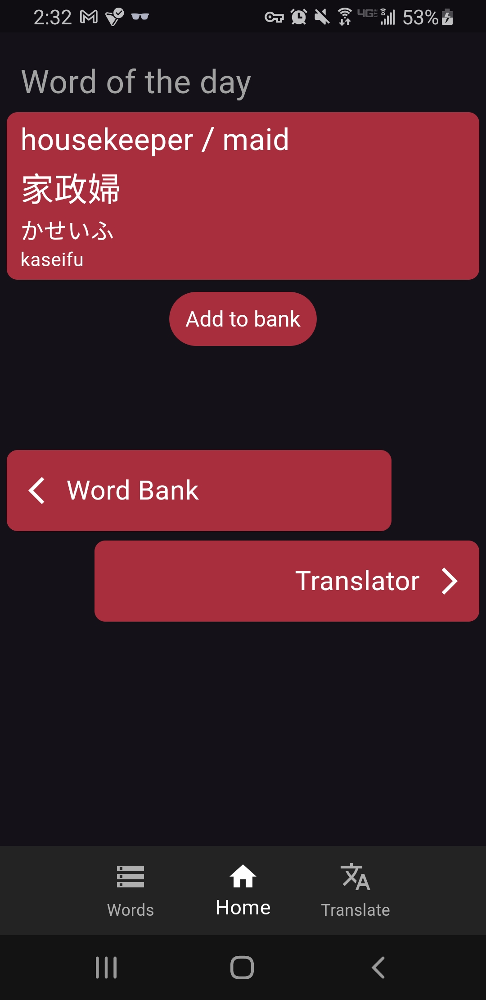

#### Bank
The words bank is where the user's words are displayed and can be searched. The search algorithm can match any of the elements (English, Kanji, Reading, Romaji). New elements can be added by clicking the add button.

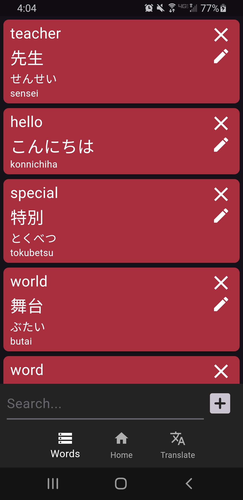

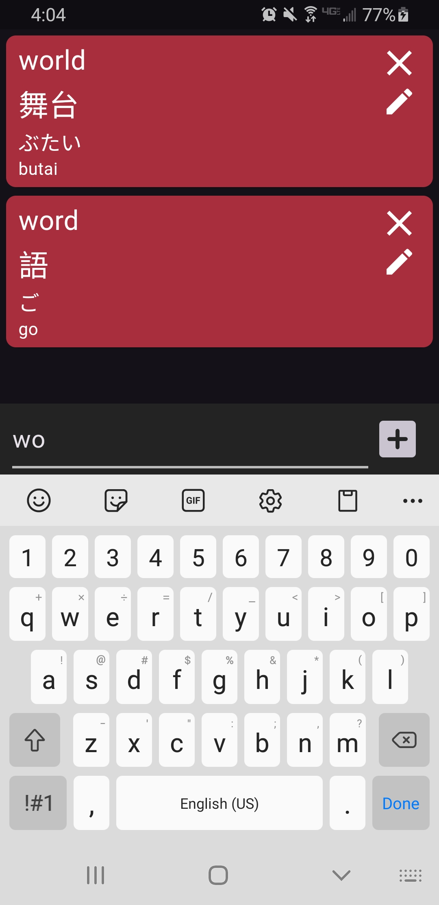
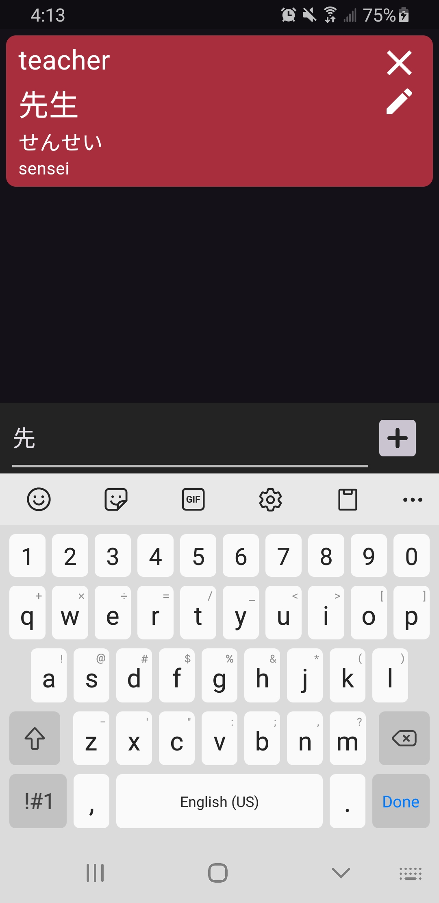

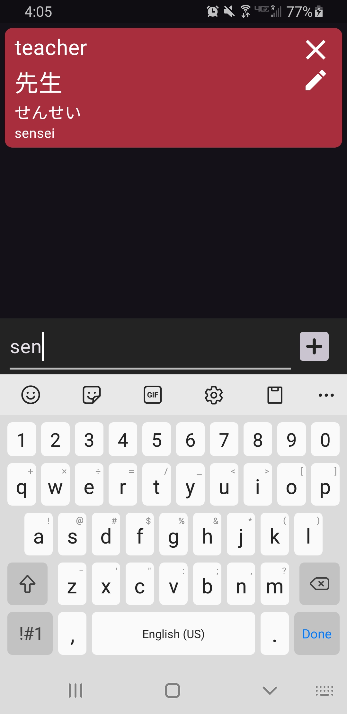

#### Editor
The editor is what the user is confronted with whenever they go to add a new word to their bank or edit an existing one. The editor has an entry for English, Kanji, and a reading element (Hirigana or Katakana). The button in the upper right is the toggle for auto-translator. It is on by default for entering new terms, and off by default when editing an existing term.

As the user types in an English term (if auto-translate is on) it will attempt to translate the term. At any time, the user can click the dropdown where it will have a list of best suggestions for what the user is looking for. Selecting one of these will update/erase the reading element, as well as the romaji. The final image is an example of auto-translate being off.

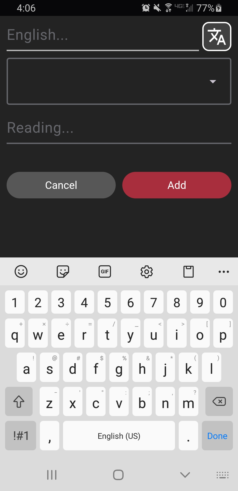

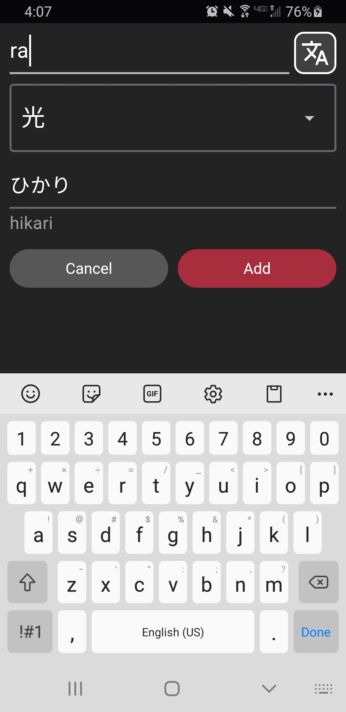
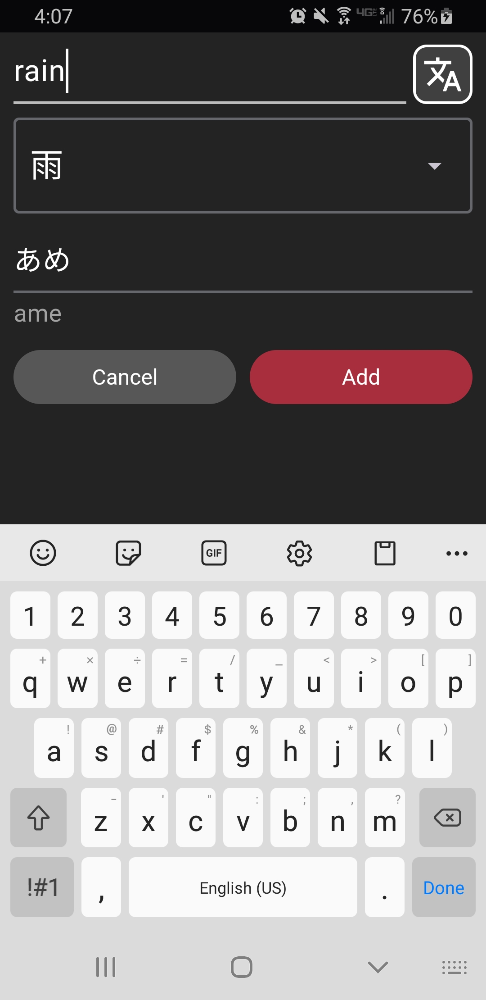
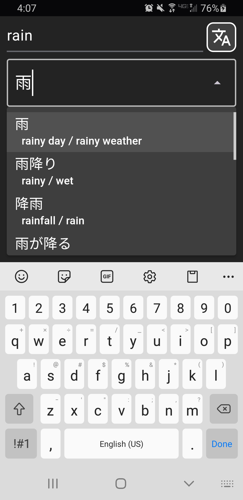

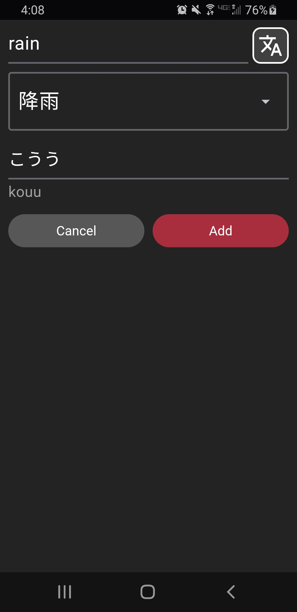
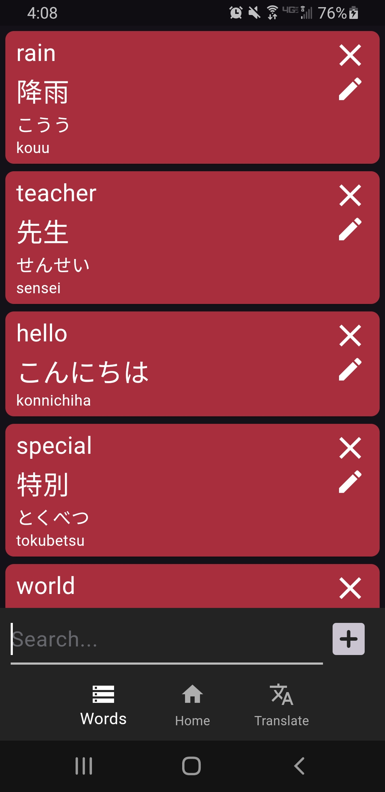
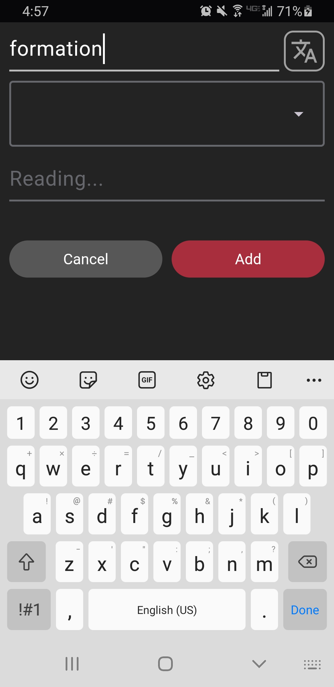

#### Translator
Very similar to the auto-translate tool in the editor, this uses the same algorithm to help find a word/term the user is looking for. It's a better interface for translating, and is able to display more information. The user can also use the button on any card to open it in the editor and add it to their bank.

The translator is also capable of translating from Japanese to English. It can translate from any of the Japanese elements: Kanji, Kana, and Romaji.

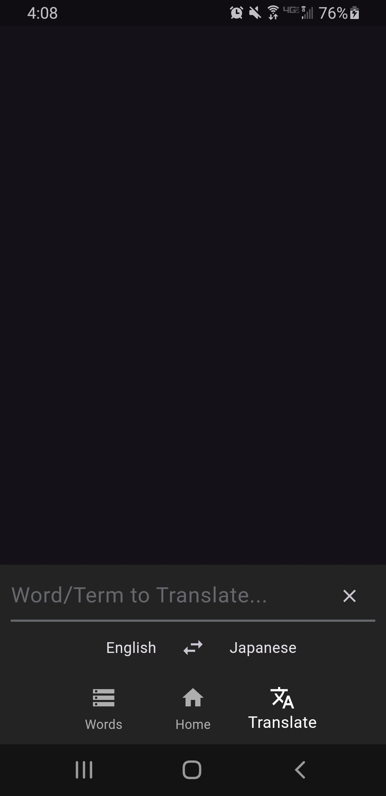

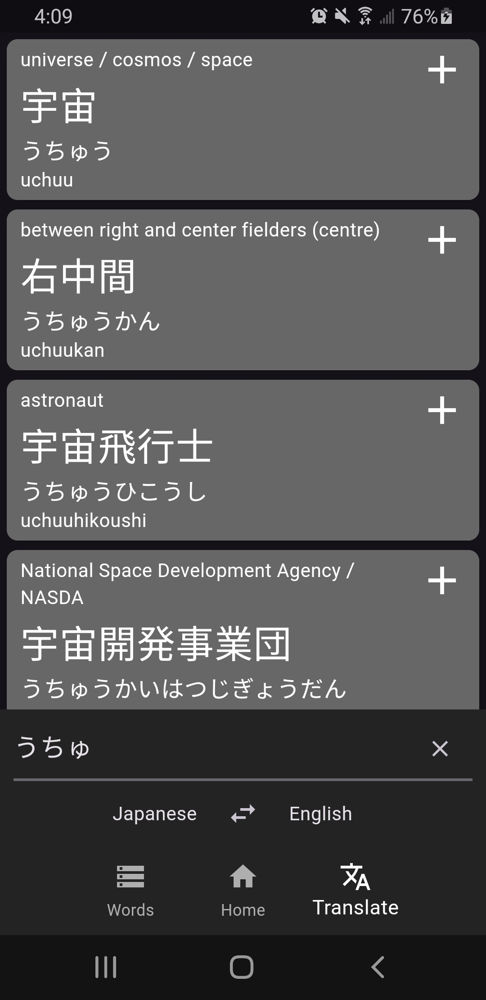
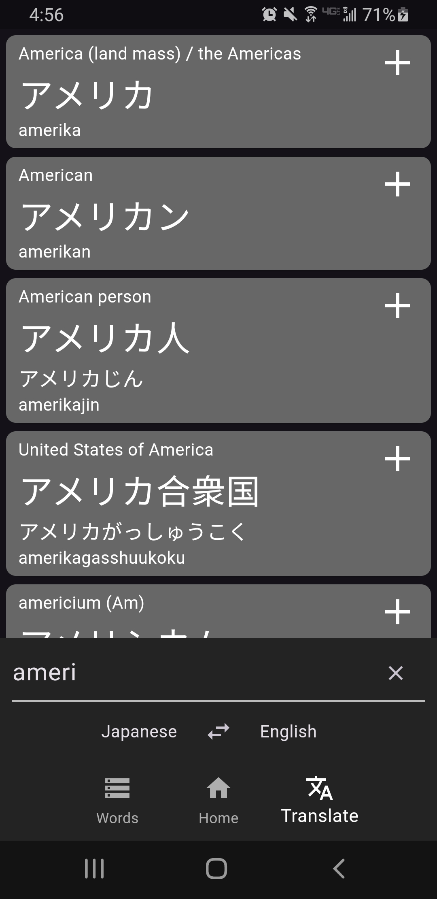